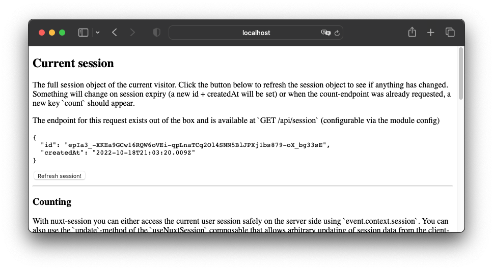

# nuxt-session

[![npm version][npm-version-src]][npm-version-href]
[![npm downloads][npm-downloads-src]][npm-downloads-href]
[](https://GitHub.com/sidebase/nuxt-session/)
[![License][license-src]][license-href]
[](https://twitter.com/sidebase_io)
[](https://discord.gg/NDDgQkcv3s)

> Nuxt session middleware to get a persistent session per app user, e.g., to store data across multiple requests. The nuxt session module provides the `useSession()` composable out of the box and sets up API endpoints to interact with your session to make working with sessions feel like a breeze.

## Quick start

1. Install the package:
    ```bash
    npm i -D @sidebase/nuxt-session
    ```
2. Add the package to your `nuxt.config.ts`:
    ```bash
    export default defineNuxtConfig({
      modules: ['@sidebase/nuxt-session'],
    })
    ```
3. Done! Each client will now have a unique session you can access on the server- and client side:
    - client-side (from any `.vue` file):
        ```ts
        const { session, refresh, update, reset } = await useSession()

        // Reactive session object that updates after methods calls below
        session.value

        // Refresh the session
        await refresh()

        // Update the session with arbitrary data
        await update({ test: 123 })

        // Get a new session, all data will be lost, the session id and creation time will change
        await reset()
        ```
    - server-side (e.g., from `server/api` files):
        ```ts
        import { eventHandler } from 'h3'

        // Return all session data to the frontend
        export default eventHandler(event => event.context.session)
        ```

The `nuxt-session` library provide many helpers to interact with the session from the client- and server-side For more documentation and examples look at the [documentation](#documentation)

## Features

- ✔️ Persistent sessions across requests using cookies
- ✔️ `useSession` composable for client side session-interaction
- ✔️ Configurable session endpoints out of the box:
    - `GET /api/session`: Get the current session
    - `DELETE /api/session`: Delete the current session
    - `POST /api/session`: Overwrite the current session data
    - `PATCH /api/session`: Add to the current session data
- ✔️ Storage via [unjs/unstorage](https://github.com/unjs/unstorage) - use memory, redis, fs, cloudflare-kv, ... drivers to store your session data
- ✔️ Automatic session and storage cleanup on expiry

Use the module-playground (see playground below) to play around with the module. Read the [documentation](#documentation) if you want to learn about the library without starting your local environment.

## Playground

An example page making use of `nuxt-session`:


See the playground to interactively use this:
```sh
> git clone https://github.com/sidebase/nuxt-session

> cd nuxt-session

> npm i

> npm run dev:prepare

> npm run dev

# -> open http://localhost:3000
```

## Documentation

First of all: Try out the playground if you want to test-drive this package and learn how to use it. You can also have a look [at the playground code](./playground/app.vue) to see how to use `nuxt-session` in your app.

The `nuxt-session` maintains sessions: Persistent data across different requests by the same client (or: "user"). To maintain these sessions, `nuxt-session` sets a cookie with a unique client id for the currently connected client. Then after the cookie is set, the client will be uniquely identifiable by the server as long as:
- the client sends this cookie on all subsequent requests,
- the clients stay is shorter than the maximum session duration (default: 10 minutes, can be infinite in theory),
- the server does not lose its data (e.g., due to a broken hard-drive)

We call this "stay" that lasts as long as the above criteria are met a session.

Below we describe:
1. [Session data](#session-data)
    - [Client-side access](#client-side-access)
        - [Advanced Client-Side Usage](#advanced-client-side-usage)
    - [Server-side access](#server-side-access)
2. [Configuration](#configuration)
3. [Storage Drivers](#storage-drivers)
    - [Example of using a different storage driver](#example-of-using-a-different-storage-driver)
4. [Security](#security)
5. [Development](#development)

### Session Data

The session that `nuxt-session` maintains for you also allows you to store arbitrary data in a storage across requests for the entire duration of the session. `nuxt-session` makes this data available to you in different ways, depending on whether you are on the client side (e.g., `.vue` components that are seen by your users) or on the server-side (e.g., inside an endpoint in the `server/api/` directory).

Reading session data is generally safe on both the client- and server-side, unless it contains anything you don't want your users to see.

Allowing alteration of session-data with arbitrary data provided by the client (e.g., your user) should be treated carefully, but can be safely done if you don't care about your users polluting sessions, have authentication and authorization or are generally not concerned about the security of your app.

#### Client Side Access

On the client-side you can use the session like this:
```ts
const {
  session,
  refresh,
  remove,
  reset,
  update,
  overwrite
} = await useSession()

// The session itself, a ref that automatically updates when you use the other methods below
session.value

// Refresh the session, e.g., after you've changed the session on the server side OR when you don't have an active session at the moment
await refresh()

// Delete the current session without getting a new one. Note that the next request will automatically get a new session
await remove()

// Reset the session: Under the hood this calls `remove` and then `refresh`
await reset()

// Update the current session with arbitrary data, this data is merged into the current session with the spread-syntax, so existing data remains (unless you provide new data with the same key!)
await update({ "hello": "session", "test": 1234, "userLikesCookies": true })

// Overwrite
await overwrite({ "test": "This replaces all current data of the session without overwriting the current session itself" })
```

Per default all of the above is enabled. Read on if you want to learn how to configure and disable some of the above functionalities and their respective endpoints, e.g., to secure your application.

You can configure what endpoints and utilities `nuxt-session` adds for client-side use using the module configuration. The API is fully enabled per default. If you want to turn off the whole `nuxt-session` API you can set `session: { api: { isEnabled: false } }` in the module config in your `nuxt.config.ts`. If you want to keep the api enabled but allow just certain operation by the client-side, you can restrict the HTTP methods that should be allowed. E.g., `session: { api: { methods: ['get'] } }` would:
- add only one endpoint that allows reading the current session data (per default: `GET /api/session`)
- enable only the `session` and `refresh` properties of the `useSession` composable

After this, calling the `reset()` or `update()` functions from above would result in an error that the methods are not supported and the api endpoints would not be added to your nuxt-app. This way:
- you cannot accidentaly call a composable-method during development and it later does not work in production,
- if somebody tried to manually access the endpoints they would not succeed as the endpoint does not exist

For all configuration options check out [the configuration section](#configuration).

##### Advanced Client-Side Usage

The methods that `nuxt-session` expose are `useFetch` calls under the hood. For advanced use, debugging and error handling their result is directly exposed. So when you use one of them, you can destructure just like with [nuxt useFetch](https://v3.nuxtjs.org/api/composables/use-fetch#usefetch):
```ts
const { data, pending, error, refresh } = await update({ "hello": "session", "test": 1234, "userLikesCookies": true })

// ... do something with the above reactive useFetch properties
```

#### Server Side Access

`nuxt-session` makes the data of the current session available to all endpoints and middlewares as part of the `event` that is passed into the endpoints and middlewares at `event.context.session`. For example [here's](https://github.com/sidebase/nuxt-session/blob/main/playground/server/api/count.get.ts) how you can implement a server-side request counting endpoint that stores how many requests to this endpoint where performed by that specific session:
```ts
// File: `playground/server/api/count.get.ts`
export default eventHandler((event) => {
  // Get the current count or set to 0 if this is the first request
  const currentCount = event.context.session.count || 0

  // Increase the count (nuxt-session will persist all changes made to `event.context.session` after the return)
  event.context.session.count = currentCount + 1

  // Return the count
  return event.context.session.count
})
```

All changes made to the `event.context.session` are automatically stored for subsequent requests by `nuxt-session`. So the count is set to `0` on the first request and then increases by `1` on every subsequent request.

The server-side session also contains its own meta-data of the form:
```ts
declare interface Session {
  id: string
  createdAt: Date
}
```

In theory you can manipulate this data on the server side if you want to. If you do this, the session will likely become invalid in the process, so proceed at your own risk!

### Configuration

Here's what the full _default_ module configuration looks like:
```ts
{
  // Module is enabled
  isEnabled: true,
  session: {
    // Sessions expire after 600 seconds = 10 minutes
    expiryInSeconds: 60 * 10,
    // Session ids are 64 characters long
    idLength: 64,
    // All session data is stored in a "sub-storage" that uses the `sessions` prefix
    storePrefix: 'sessions',
    // The session cookie same site policy is `lax`
    cookieSameSite: 'lax',
    // `Secure` attribute of session cookie is set to `true`
    cookieSecure: true,
    // `HttpOnly` attribute of session cookie is set to `true`
    cookieHttpOnly: true,
    // In-memory storage is used (these are `unjs/unstorage` options)
    storageOptions: {
        driver: 'memory',
        options: {}
    },
    // The request-domain is strictly used for the cookie, no sub-domains allowed
    domain: false,
    // Sessions aren't pinned to the user's IP address
    ipPinning: false,
    // Expiration of the sessions are not reset to the original expiryInSeconds on every request
    rolling: false
  },
  api: {
    // The API is enabled
    isEnabled: true,
    // `PATCH, GET, POST, DELETE /api/session` HTTP requests are possible
    methods: ['patch', 'get', 'post', 'delete'],
    // The sessions endpoints are mounted at `/api/session`
    basePath: '/api/session'
  }
}
```

### Storage Drivers

`nuxt-session` allows you to use different storage drivers. A storage driver is something like your server memory, a redis database, the file-system of your server, ... Supporting these drivers is possible by using [unjs/unstorage](https://github.com/unjs/unstorage) for storage management. This library connects to the different drivers it supports with a unified interface.

You can configure the storage driver using the `session.session.storageOptions` configuration option of the `nuxt-session` module. By default `memory` is used to store the sessions. This has some advantages like speed and easy setup, but some disadvantages like missing persistency (if your server crashes, the sessions are gone!) and possible exploits like setting millions of sessions trying to exhaust your server-memory or saving large amounts of data into the session that your server cannot handle.

Check out here what storage drivers are supported and how to configure them: https://github.com/unjs/unstorage#drivers

#### Example of using a different storage driver

You can use any storage driver supported by [unjs/unstorage](https://github.com/unjs/unstorage). For example, here is how you can configure the module to use the `redis` driver:
```ts
// file: ~/nuxt.config.ts
export default defineNuxtConfig({
  modules: ['@sidebase/nuxt-session'],
  session: {
    session: {
      storageOptions: {
        driver: 'redis',
        options: {
          url: 'redis://localhost:6379'
        }
      }
    }
  }
})
```

### Security

This section mostly contains a list of possible security problems and how to mitigate (some) of them. Note that the below flaws exist with many libraries and frameworks we use in our day-to-day when building and working with APIs. E.g., your vanilla-nuxt-app is not safe of some of them like the client sending malicious data. Missing in the below list are estimates of how likely it is that one of the list-items may occur and what impact it will have on your app. This is because that heavily depends on:
- your app: Are you building a fun project? A proof of concept? The next fort-nox money management app?
- your environment: Building a freely available app for fun? Have authentication in front of your app and trust all users that successfully authenticated? Superb! Don't trust anyone? Then please be extra-careful when using this library and when building you backend in general

Without further ado, here's some attack cases you can consider and take action against. Neither the attack vectors, the problems or the mitigations are exhaustive:
1. sending arbitrary data
    - problems: Denial-of-Service by server-ressource exhaustion (bandwidth, cpu, memory), arbitrary code execution (if you parse the data), ...
    - possible mitigations:
        - disable api-access to session data (`api.isEnabled: false`) or restrict it to only reading (`api: { methods: ['get'] }`)
        - parse & validate data securely on the server side before storing it into the session, e.g., using [zod](https://github.com/colinhacks/zod)
        - we at some point implement some settings for this (e.g., max session amount, size, ...)
2. creation arbitrarily many sessions
    - problems: Denial-of-Service by server-ressource exhaustion (bandwidth, cpu, memory)
    - possible mitigations:
        - add authentication and possibly authorization to your app
        - use `redis` as a storage driver and set data to expire automatically
3. guessing correct session ids
    - problems: session data can leak
    - possible mitigations:
        - disable reading of data on the client side by disabling the api or setting `api: { methods: [] }`
        - increase the default sessionId length (although with `64` characters it already is quite long, in 2022)
        - use the `ipPinning` flag (although this means that everytime the user changes IP address, they'll lose their current session)
4. stealing session id(s) of client(s)
    - problem: session data can leak
    - possible mitigations:
        - increase cookie protection, e.g., by setting `session.cookieSameSite: 'strict'` (default: `lax`)
        - use very short-lived sessions
        - don't allow session renewal

A last reminder: This library was not written by crypto- or security-experts. So please proceed at your own risk, inspect the code if you want to and open issues / pull requests where you see room for improvement. If you want to file a security-concern privately, please send an email to `support@sidestream.tech` with the subject saying "SECURITY nuxt-session" and we'll look into your request ASAP.

### Development

- Run `npm run dev:prepare` to generate type stubs.
- Use `npm run dev` to start [the module playground](./playground) in development mode.
- Run `npm run lint` to run eslint
- Run `npm run types` to run typescheck via tsc


<!-- Badges -->
[npm-version-src]: https://img.shields.io/npm/v/@sidebase/nuxt-session/latest.svg
[npm-version-href]: https://npmjs.com/package/@sidebase/nuxt-session

[npm-downloads-src]: https://img.shields.io/npm/dt/@sidebase/nuxt-session.svg
[npm-downloads-href]: https://npmjs.com/package/@sidebase/nuxt-session

[license-src]: https://img.shields.io/npm/l/@sidebase/nuxt-session.svg
[license-href]: https://npmjs.com/package/@sidebase/nuxt-session
